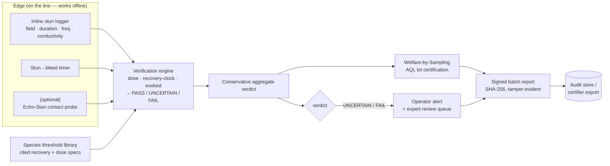

# StunAssure — Architecture

StunAssure answers one question, cheaply and fail-safe:

> **Was each batch of fish rendered insensible, and did it stay insensible until death?**

It does this as a four-layer *verification stack*: **measure the stun physically → verify
insensibility → enforce the recovery window → certify the batch statistically.** Every layer fills
a translation gap — the underlying welfare science exists, but a practical verification layer does
not — which keeps scientific risk low and implementation novelty high.

StunAssure flags welfare **risk** and verifies **process delivery**. It does **not** determine
consciousness or guarantee humane slaughter. Any `UNCERTAIN` verdict routes to manual/expert review.

---

## 1. The fail-safe contract (why this is not "another AI camera")

The dangerous error in welfare is a **false "safe."** The engine therefore never certifies on the
absence of evidence:

| Rule | Behaviour |
|---|---|
| Missing / un-verifiable input | → **UNCERTAIN** (route to manual check), never PASS |
| Recovery-clock breach (stun→bleed too long) | → **FAIL** (hard) |
| Species with no published electrical spec | → dose **UNCERTAIN**, never a fabricated pass |
| Aggregation across layers | **conservative** — the worst layer dominates, no averaging |
| Heartbeat / cardiac signal | **rejected** as insensibility evidence (the fish heart is myogenic and beats for minutes after brain death) |

---

## 2. The four verification layers (decision order)

| # | Layer | Question it answers | Inputs | Module |
|---|---|---|---|---|
| 1 | **Dose** | Was an adequate electrical dose delivered? | field strength (V/cm), duration, frequency, water conductivity, species spec | `engine._check_dose` |
| 2 | **Recovery-clock** | Was the fish bled/killed *before* it could recover? | stun→bleed interval vs species recovery-onset threshold | `engine._check_recovery_clock` |
| 3 | **Echo-Stun** (optional) | Did the fish still show an evoked response? | contact/skin-surface evoked-response index | `engine._check_evoked_response` |
| 4 | **Welfare-by-Sampling** | Can we certify the whole batch at stated confidence? | per-fish verdicts of a validated subsample + lot size + AQL | `sampling` |

Each per-fish result is a three-state, severity-ordered `Verdict`: `FAIL (0) < UNCERTAIN (1) < PASS (2)`.
The aggregate is `min(...)` over the layers — the conservative rule, in one line.

---

## 3. Data flow

Core shape: **multimodal inputs → conservative risk engine → operator signal
(pass / uncertain→check / fail→intervene) → signed batch audit record.**

---

## 4. C4 — container view

- **Edge logger** (design; not in this repo) — an ESP32-class device that captures dose + interval
  at the stunner, runs the same verdict logic on-device, buffers offline, and syncs signed records
  when a link is available.
- **Verification core** (`src/stunassure`) — the portable, zero-runtime-dependency Python package:
  species library, dose/recovery/echo checks, conservative aggregation, sampling, signed reports,
  a simulator, and a CLI. This is the trust anchor and it runs anywhere.
- **API service** (`stunassure.api`, optional `[api]` extra) — a thin FastAPI transport over the
  core for dashboards, certifier exports, and fleet aggregation. It is a transport, **not** a second
  decision path — it cannot weaken the fail-safe contract.
- **Cloud tier** (optional) — managed ingestion, storage, and the API container. See
  [`deployment/azure.md`](deployment/azure.md) and [`deployment/aws.md`](deployment/aws.md).

---

## 5. Design invariants (enforced by tests)

- The **core has zero runtime dependencies.** Third-party libraries live only in optional extras.
- Reports are **deterministic**: the timestamp is passed in, never read from the wall clock, so the
  same inputs always produce the same SHA-256 signature.
- A lot is certified **only if every sampled fish positively PASSED**. An `UNCERTAIN` counts as a
  sample defect — we never certify on absence of evidence.
- Every welfare threshold in `species.py` is traceable to a cited source; unknown specs are encoded
  as un-verifiable, never invented.

---

## 6. Module map

| Module | Responsibility |
|---|---|
| `engine.py` | Per-fish verification: dose, recovery-clock, Echo-Stun; conservative aggregation |
| `species.py` | Cited species threshold & electrical-spec library (fail-safe on unknowns) |
| `sampling.py` | Zero-acceptance (c=0) hypergeometric lot certification (ISO 2859 / AQL family) |
| `report.py` | SHA-256-signed, tamper-evident batch report (JSON + Markdown) |
| `simulator.py` | Reproducible synthetic batches with injectable failure modes (zero live fish) |
| `cli.py` | `stunassure demo` / `stunassure species` |
| `api.py` | Optional FastAPI service over the core |
