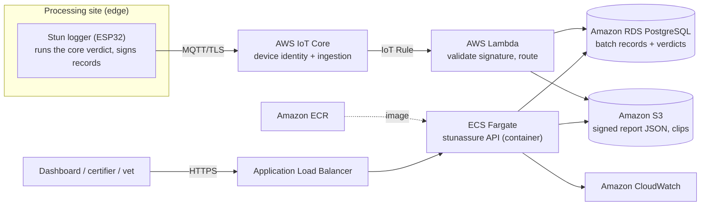

# Deploying StunAssure on AWS

A reference architecture for running the StunAssure API + audit store as a managed cloud service,
with edge stun-loggers on processing lines syncing signed batch records.

> **StunAssure is offline-first by design.** The verification verdict is computed at the edge by the
> zero-dependency core; the cloud tier is for aggregation, storage, dashboards, and certifier
> exports. A site with no connectivity still produces valid, signed local reports.

## Reference architecture



## Service mapping

| Concern | AWS service | Notes |
|---|---|---|
| Device identity + ingestion | **AWS IoT Core** | Per-device X.509 auth, MQTT over TLS, rules engine |
| API compute | **Amazon ECS on Fargate** | Runs the `Dockerfile` image; serverless containers (App Runner is a simpler alternative) |
| Image registry | **Amazon ECR** | Stores the API container image |
| Relational store | **Amazon RDS for PostgreSQL** | Batch records, verdicts, audit trail |
| Object store | **Amazon S3** | Signed report JSON + any video/sensor clips (versioning on) |
| Event handling | **AWS Lambda** (via IoT Rule) | Validate the SHA-256 signature on arrival, route to stores |
| Ingress | **Application Load Balancer** | TLS termination, health checks on `/health` |
| Observability | **Amazon CloudWatch** | Metrics, logs, alarms |
| Secrets | **AWS Secrets Manager** | DB credentials, connection strings |

## Cost estimate — pilot scale

**Assumptions:** ~10 sites, low-thousands of batches/day, ~100 GB storage, one always-on Fargate
task (0.5 vCPU / 1 GiB), a small single-AZ database. Region: us-east-1. Figures are **indicative
list prices** — always confirm with the [AWS Pricing Calculator](https://calculator.aws/) for your
region, Savings Plans, and current rates.

| Service | Configuration | Indicative USD / month |
|---|---|---|
| ECS Fargate | 1 task, 0.5 vCPU / 1 GiB, always-on | $18 – 30 |
| Application Load Balancer | 1 ALB, low LCU | $18 – 22 |
| RDS PostgreSQL | **db.t4g.micro**, single-AZ, 20 GB gp3 | $15 – 25 |
| S3 (Standard) | ~100 GB + requests | $3 – 6 |
| AWS IoT Core | Messages + connections (low volume) | $3 – 12 |
| AWS Lambda | Low invocation volume | $0 – 3 |
| Amazon ECR | Image storage | $1 – 3 |
| CloudWatch | Logs + metrics | $5 – 10 |
| Data transfer out | Modest | $3 – 8 |
| **Estimated total** | | **≈ $70 – 120 / month** |

> **Tip:** dropping the ALB and using **AWS App Runner** (or a Lambda + API Gateway function-URL
> pattern) removes the ~$20/mo ALB baseline for very small deployments, landing a POC near
> **$40–60/month**. Many services also have 12-month free-tier allowances.

**Scaling to production (HA):** move RDS to Multi-AZ with a larger instance class (~$120–250/mo),
run 2–3 Fargate tasks across AZs behind the ALB, and enable S3 lifecycle + cross-region replication
for the audit store. A resilient multi-site production deployment typically lands around
**$350–650 / month** before Savings Plans.

## Deploy sketch

```bash
# Build & push the image to ECR
aws ecr get-login-password | docker login --username AWS --password-stdin <acct>.dkr.ecr.<region>.amazonaws.com
docker build -t stunassure:0.1.0 .
docker tag stunassure:0.1.0 <acct>.dkr.ecr.<region>.amazonaws.com/stunassure:0.1.0
docker push <acct>.dkr.ecr.<region>.amazonaws.com/stunassure:0.1.0

# Then define an ECS task/service (Fargate) using that image, target port 8000,
# with the ALB health check pointed at /health. Store DB creds in Secrets Manager.
```
