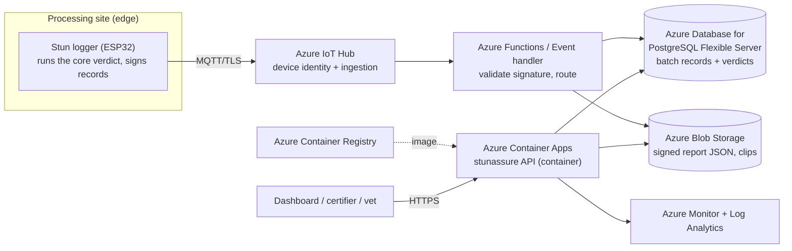

# Deploying StunAssure on Azure

A reference architecture for running the StunAssure API + audit store as a managed cloud service,
with edge stun-loggers on processing lines syncing signed batch records.

> **StunAssure is offline-first by design.** The verification verdict is computed at the edge by the
> zero-dependency core; the cloud tier is for aggregation, storage, dashboards, and certifier
> exports. A site with no connectivity still produces valid, signed local reports.

## Reference architecture



## Service mapping

| Concern | Azure service | Notes |
|---|---|---|
| Device identity + ingestion | **Azure IoT Hub** | Per-device auth, MQTT over TLS, offline buffering on device |
| API compute | **Azure Container Apps** | Runs the `Dockerfile` image; scale-to-zero or min-1 replica |
| Image registry | **Azure Container Registry (Basic)** | Stores the API container image |
| Relational store | **Azure Database for PostgreSQL — Flexible Server** | Batch records, verdicts, audit trail |
| Object store | **Azure Blob Storage (Hot)** | Signed report JSON + any video/sensor clips |
| Event handling | **Azure Functions** (Consumption) | Validate the SHA-256 signature on arrival, route to stores |
| Observability | **Azure Monitor + Log Analytics** | Metrics, logs, alerting |
| Secrets | **Azure Key Vault** | DB credentials, connection strings |

## Cost estimate — pilot scale

**Assumptions:** ~10 sites, low-thousands of batches/day, ~100 GB storage, one always-on API
replica (1 vCPU / 2 GiB), a Burstable database. Region: West Europe. Figures are **indicative
list prices** — always confirm with the [Azure Pricing Calculator](https://azure.com/e/) for your
region, reservations, and current rates.

| Service | Configuration | Indicative USD / month |
|---|---|---|
| Azure Container Apps | 1 replica, 1 vCPU / 2 GiB, always-on | $35 – 45 |
| PostgreSQL Flexible Server | Burstable **B1ms** (1 vCore, 2 GiB) + 32 GB storage | $15 – 25 |
| Blob Storage (Hot) | ~100 GB + transactions | $3 – 6 |
| Azure IoT Hub | **B1** basic tier (~400k msgs/day) | $10 – 25 |
| Container Registry | Basic | $5 |
| Azure Functions | Consumption (low volume) | $0 – 5 |
| Azure Monitor / Log Analytics | A few GB ingested | $5 – 10 |
| Egress bandwidth | Modest | $3 – 8 |
| **Estimated total** | | **≈ $80 – 130 / month** |

**Free / dev tier:** IoT Hub has a Free tier (8k msgs/day), Container Apps includes a monthly free
grant, and Functions Consumption has a free monthly quota — a proof-of-concept can run for a few
dollars a month.

**Scaling to production (HA):** move PostgreSQL to a General Purpose tier with a read replica and
zone-redundant HA (~$150–300/mo), run 2–3 API replicas across zones, and step IoT Hub up to an S1
tier. A resilient multi-site production deployment typically lands around **$400–700 / month**
before reserved-instance discounts.

## Deploy sketch

```bash
# Build & push the image
az acr build -r <registry> -t stunassure:0.1.0 .

# Create the Container App from the image
az containerapp create \
  -n stunassure-api -g <rg> --environment <env> \
  --image <registry>.azurecr.io/stunassure:0.1.0 \
  --target-port 8000 --ingress external \
  --min-replicas 1 --max-replicas 3 \
  --cpu 1 --memory 2Gi
```

Store the PostgreSQL connection string and any credentials in **Key Vault** and reference them as
Container Apps secrets — never bake them into the image.
